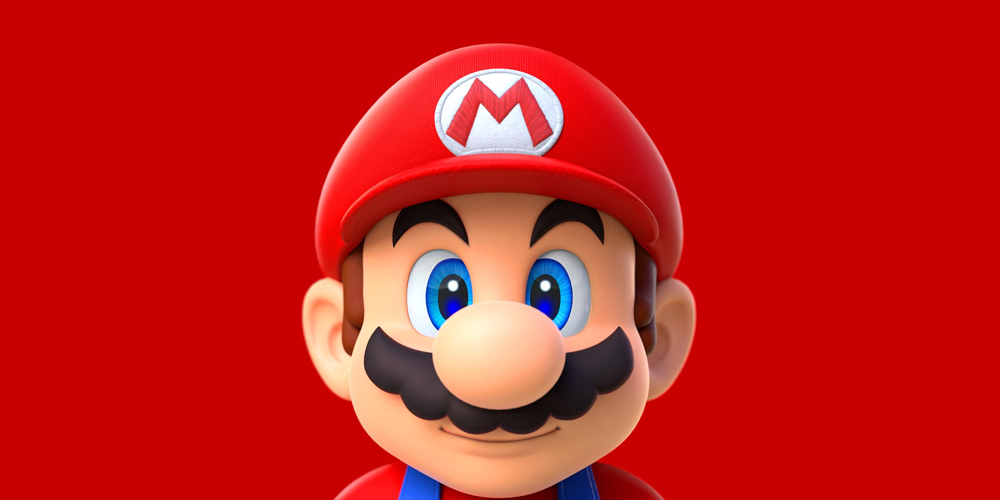

# mario

Build system. Task runner. Pipelines made easy.

 

## What is it

## Binaries || Installation

 

via go:

`$ go get -u github.com/kcmerrill/mario`

via docker:

`$ docker run -v $PWD:$PWD -w $PWD kcmerrill/mario`